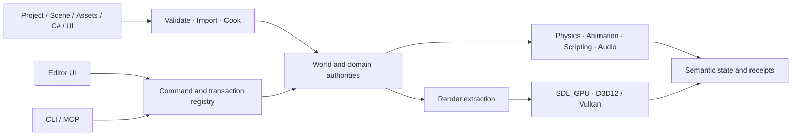

<div align="center">

# Noemancer

**A C++20 game engine and editor in active development.**

[简体中文](README.md) · [English](README.en.md)

[](LICENSE)


</div>


## Latest rendering


The scene contains roughly 2.05 million vertices, 11.24 million indices, 405 primitives, and 72 material images. The image above is the D3D12 capture; matching Vulkan captures were recorded for both published views.

| Upper arcade | Raster material baseline |
| --- | --- |
|  |  |

These are hidden Release captures from the engine, not offline renders or concept images. The Classic baseline closes Project → Cook → Package → Player; Sponza currently proves the external Source Project, JSON glTF dependency closure, and live D3D12/Vulkan paths. Large-scene Cook and Package remain open. Sponza 2022 was created by Frank Meinl, sponsored by Anton Kaplanyan, published by Intel, and is used under [CC BY 4.0](https://creativecommons.org/licenses/by/4.0/). RenderLab keeps the full geometry in an external test project and derives 1K material textures; the large source asset is not committed to this repository.

Noemancer is not an editor shell around an existing engine. The repository contains the native Editor, game Runtime, asset Cook, standalone Player packaging, C# project scripting, and one engine command layer exposed through CLI and MCP.

The current build can create and open projects, author scenes, input and project UI, run C# game logic in an isolated Play World, and package a standalone Windows Player. It remains **pre-alpha**: contracts will change, Windows x64 is the only end-to-end verified platform, and unfinished work such as hardware ray tracing, RTGI and VSM is not presented as a current feature.

## Current capabilities

- **Editor:** Project Hub, Scene View, Outliner, Inspector, Asset Browser, Console, Animation Graph, Agent Context, isolated Edit/Play Worlds, selective Apply Back, and revisioned undoable authoring. The official launcher defaults to Simplified Chinese and can switch to English.
- **Runtime:** Flecs ECS, Jolt physics, ozz animation and GPU skinning, .NET 10 / C# scripts with hot-reload state migration, RmlUi/CSS project UI, HarfBuzz/ICU text, miniaudio, GPU VFX, Prefabs, Save and Replay.
- **Rendering:** SDL_GPU D3D12/Vulkan, Forward PBR, split-sum IBL, CSM and Point/Spot shadows with caches, GPU frustum culling and indexed indirect draws for compatible static geometry, four-LUT dynamic atmosphere, shared HiZ, SSR, SSGI, TAA, GTAO with bilateral filtering, Bloom, exposure/grading and ACES tone mapping.
- **Hybrid Pixel / HD2D:** virtual resolution, integer presentation, pixel-aligned Sprite/VFX output, mixed 2D/3D lighting and controlled post processing without a second renderer.
- **Assets:** offline GLB/JSON glTF/FBX import, KTX2 BasisLZ/UASTC, meshoptimizer geometry Cook, Sprite Atlas and Tilemap data, content/recipe-addressed artifacts, and schema/range/SHA-256 validation.
- **Distribution:** packaged Players consume runtime `.meshbin`, `.animbin` and KTX2 assets without source decode; Windows packages close app-local .NET, VC Runtime, shader manifests and third-party notices.

The default Raster path includes dynamic sky atmosphere, SSR and SSGI. Hardware ray tracing, RTGI and VSM remain in development.

## Editor, CLI, and Agent tools use the same commands

The C++ Command Registry serves the Editor, direct JSON, CLI, and MCP. Stateful work uses stable IDs, schemas and revisions:

```text
Observe -> Plan(base revision) -> Apply -> Receipt -> Undo/Redo
```

A running Editor publishes a local same-user session. MCP can attach to the World, Asset Registry, Project UI and undo journal already owned by that Editor. Without an active Editor, automation can use an isolated `serve --project` session. Public contracts do not expose Flecs, Jolt, SDL or ImGui handles.

## Validation projects

| Project | Coverage |
| --- | --- |
| `D:\3D\NoemancerProjects\NoemancerPlatformer` | Project UI/Input, C# scripting, Sprite/Tilemap, Cook, Package and standalone Player |
| `D:\3D\_tools\StarfallGauntlet` | Clean-room 2D gameplay slice with no project-native C++ |
| `D:\3D\NoemancerProjects\NoemancerRenderLab` | Public Project/Scene/Registry validation for real GLB content, dual-backend images, quality and performance; work in progress |

Exact evidence and limitations are maintained in [Current capabilities and acceptance boundaries](docs/first-acceptance-status.zh-CN.md).

## Quick start

Requirements: Windows 10/11 x64, Visual Studio 2022 with Desktop development with C++, Windows SDK, Git, CMake 3.28+, and PowerShell 5.1+.

```powershell
git clone https://github.com/Ubik42/Noemancer.git
cd Noemancer

./scripts/bootstrap-dotnet.ps1
./scripts/engine.ps1 configure
./scripts/engine.ps1 build -Config Release -Target noemancer
./scripts/engine.ps1 run -Config Release
```

`Noemancer Editor.cmd` is the product entry. Platformer `.cmd` files are validation shortcuts.

```powershell
# Headless structured run
./scripts/engine.ps1 run -Config Release --headless --frames 3 --format json

# Milestone gates
./scripts/engine.ps1 test -Config Release
./scripts/engine.ps1 test -Config Release -WithMcp
```

## Architecture



```text
noemancer_engine <- noemancer_editor <- noemancer runtime

tools/mcp   separate TypeScript process over the engine Command ABI
managed/*   separate .NET contracts and project script runtime
```

Repository map:

```text
src/engine/     World, assets, physics, animation, UI and command authority
src/editor/     Editor models and presentation
src/runtime/    SDL platform layer, renderer and executable entry
managed/        C# API and HostFXR host
schemas/        Versioned project and semantic contracts
tools/mcp/      MCP adapter
tests/          Focused and integration tests
docs/           Architecture, ADRs, plans and acceptance evidence
```

Read [Architecture](docs/architecture.md), the [Development plan](docs/development-plan.zh-CN.md), and [Capabilities and acceptance boundaries](docs/first-acceptance-status.zh-CN.md).

## Development status

The active frontier is commercial Raster validation in `NoemancerRenderLab`: real classic GLB scenes, D3D12/Vulkan Golden captures, Render Graph/shader/asset identities and performance budgets. The following stages cover external glTF/JPEG resources, larger scenes, dynamic atmosphere, shared HiZ/history/temporal denoising, SSR and SSGI. Hardware ray tracing follows only after a real native D3D12/Vulkan RT foundation and fallback path are verified.

Other open boundaries include a stable SDK/plugin ecosystem, fully responsive high-DPI editor chrome, redistributable CJK/Arabic fonts, a signed installer, independent-machine validation, production networking and cross-platform support. The machine-readable queue is [`docs/current-state.json`](docs/current-state.json).

## License

Noemancer Engine and Runtime are licensed under the [Apache License 2.0](LICENSE). Game projects, fixtures and third-party assets retain their declared licenses.
