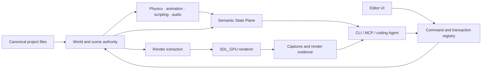

<div align="center">

# Noemancer

**An experimental C++ game engine built for humans and coding agents to share the same source of truth.**

[](LICENSE)


[Why Noemancer?](#why-noemancer) · [Features](#current-capabilities) · [Quick start](#quick-start) · [Architecture](#architecture) · [Roadmap](#roadmap)

</div>


> [!WARNING]
> Noemancer is in **pre-alpha, active development**. It is a runnable engine and production-workflow prototype, not a stable SDK or a finished alternative to established engines. Windows x64 is the only platform currently verified end to end.

## Why Noemancer?

Most open-source engines expose source code to an Agent but leave the running editor, scene state, build results and diagnostics behind unrelated interfaces. Noemancer treats Agent comprehension as an engine-level constraint:

- **One authority:** canonical scenes, assets and UI remain the source of truth; Agent projections never become a second database.
- **Progressive disclosure:** tools return bounded summaries, stable IDs and linked evidence before expanding into detailed state.
- **Reviewable edits:** mutations use revision checks and a `plan → apply → receipt` workflow with undo/redo boundaries.
- **Runtime evidence:** headless execution, semantic observations, render captures and structured diagnostics can verify more than successful compilation.
- **Ordinary files first:** project data is diffable and version-control friendly. The tool layer compresses complex operations instead of hiding the underlying state.

The goal is not to make every internal function an AI tool. It is to minimize the translation loss between source, editor, runtime and verification.

## Current capabilities

| Area | Implemented foundation |
| --- | --- |
| Editor | Scene view, Outliner, declarative Inspector, Asset Browser, Console, Agent Context, Edit/Play World isolation |
| World | Flecs ECS, canonical scene/prefab data, stable identities, transactions, undo/redo |
| Rendering | SDL_GPU, D3D12/Vulkan shaders, Forward PBR, CSM, IBL, TAAU, bloom, AO, picking, Render Graph evidence |
| 2D / HD2D | Sprites, tilemaps, 2D character motor, pixel-aligned Hybrid Pixel profile, mixed 2D/3D lighting |
| Physics | Jolt rigid bodies, sensors, contacts, ray/sphere queries and rotation-locked 2D characters |
| Animation | ozz runtime, GLB/FBX import, state machines, blend graphs, root motion and GPU skinning palettes |
| Scripting | .NET 10 / C#, HostFXR embedding, project compilation, hot reload state migration and typed World commands |
| UI and text | Semantic UI, RmlUi/CSS layout, design tokens, HarfBuzz/ICU shaping, RTL/CJK and IME foundations |
| Audio / VFX | miniaudio render snapshots and device output; versioned GPU particle graph and structured observations |
| Agent interface | Shared C++ command registry exposed through direct JSON, CLI and an MCP adapter |
| Distribution | Deterministic cook/package pipeline with app-local runtime dependencies and third-party notices |

The exact evidence-backed boundaries are maintained in [Current capabilities and limitations](docs/first-acceptance-status.zh-CN.md).

## Quick start

### Requirements

- Windows 10/11 x64
- Visual Studio 2022 with **Desktop development with C++** and the Windows SDK
- Git
- CMake 3.28 or newer
- PowerShell 5.1 or newer

The first configure downloads pinned source dependencies through CMake `FetchContent` and can take several minutes.

### Build the editor

```powershell
git clone https://github.com/Ubik42/Noemancer.git
cd Noemancer

# Installs the pinned .NET SDK under the ignored _tools directory.
./scripts/bootstrap-dotnet.ps1

./scripts/engine.ps1 configure
./scripts/engine.ps1 build -Config Release -Target noemancer
./scripts/engine.ps1 run -Config Release
```

Noemancer prefers its pinned local CMake distribution when present and otherwise uses `cmake` from `PATH`.

### Headless smoke test

```powershell
./scripts/engine.ps1 run -Config Release --headless --frames 3 --format json
```

### Run tests

```powershell
# Focused inner loop
./scripts/engine.ps1 check -Config Release `
  -Target noemancer_simulation_runtime_tests `
  -TestRegex noemancer.simulation_runtime

# Complete milestone gate
./scripts/engine.ps1 test -Config Release

# Include the optional MCP build and smoke test
./scripts/engine.ps1 test -Config Release -WithMcp
```

## Agent interface

The CLI and MCP adapter discover the same engine-owned command manifest:

```powershell
./scripts/engine.ps1 run -Config Release tools list --format json
'{"frames":3}' | ./scripts/engine.ps1 run -Config Release tool call run.headless
```

Commands expose schemas, authority scope and bounded results. Stateful edits use stable IDs and revision checks so a caller can preview a change, apply it, and inspect the receipt without directly manipulating engine handles.

## Architecture



Third-party systems remain behind engine-owned adapters. Flecs entities, Jolt body IDs, SDL handles and GPU resources do not cross project persistence, scripting or Agent ABIs.

## Repository map

```text
src/engine/     World, assets, physics, animation, UI and command authority
src/editor/     Editor models and presentation
src/runtime/    SDL platform layer, renderer and executable adapter
managed/        C# scripting API and HostFXR host
schemas/        Versioned project and semantic contracts
tools/mcp/      MCP adapter over the engine command manifest
tests/          Focused and integration-level CTest targets
docs/           Architecture, ADRs, current state and historical research
```

Start with [Documentation authority](docs/README.md), then read [Architecture](docs/architecture.md) and the [Development plan](docs/development-plan.zh-CN.md). Historical research is explicitly non-authoritative unless adopted by a current ADR or plan.

## Roadmap

Near-term work is focused on:

1. completing project UI authoring and interaction;
2. applying production pressure with larger sprite and tilemap workloads;
3. validating a small HD2D game slice;
4. improving independent-machine packaging, performance evidence and raster quality;
5. extending project-attached Agent transport without duplicating engine state.

See [current-state.json](docs/current-state.json) for the machine-readable frontier.

## Contributing

Noemancer is early enough that architecture changes quickly. Please read [CONTRIBUTING.md](CONTRIBUTING.md) before opening a pull request. Bug reports should include the configuration, GPU backend, reproduction steps and the smallest relevant structured diagnostic or log.

For vulnerabilities, follow [SECURITY.md](SECURITY.md) instead of opening a public issue.

## Acknowledgements

Noemancer builds on mature open-source projects including SDL, Flecs, Jolt Physics, ozz-animation, RmlUi, Dear ImGui, miniaudio, fastgltf, ufbx, meshoptimizer, KTX-Software, FreeType, HarfBuzz, ICU and nlohmann/json. Generated packages carry the applicable license texts and a deterministic third-party notice.

## License

Noemancer engine source and Runtime are licensed under the [Apache License 2.0](LICENSE). Game projects, test fixtures and third-party assets retain their own declared licenses.
