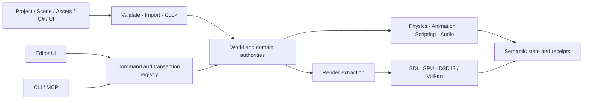

<div align="center">

# Noemancer

**一套正在开发的 C++20 游戏引擎与编辑器。**

[简体中文](README.md) · [English](README.en.md)

[](LICENSE)


[当前能力](#当前能力) · [快速开始](#快速开始) · [架构](#架构) · [开发状态](#开发状态)

</div>


Noemancer 不是现成引擎的编辑器外壳。目前仓库已经包含原生 Editor、游戏 Runtime、资产 Cook、独立 Player 打包、C# 项目脚本，以及由同一套引擎命令驱动的 CLI 和 MCP 接口。

当前版本可以从 Project Hub 创建或打开工程，在 Editor 中编辑 Scene、组件、输入和项目 UI，进入隔离的 Play World 运行 C# 游戏逻辑，再把资产与运行时依赖打成可独立启动的 Windows Player。引擎仍处于 **pre-alpha**：公开 API 会变化，只完整验证了 Windows x64，也不把尚未完成的 SSR、SSGI、动态大气或硬件光追写成现有能力。

## 当前能力

### 编辑器与项目工作流

- 官方入口 `Noemancer Editor.cmd` 默认使用简体中文，也可切换 English。
- Project Hub 支持创建工程、打开工程与最近工作区；Starter 和 Hybrid Pixel 模板使用同一 Project Workspace 服务。
- Editor 包含 Scene View、World Outliner、Inspector、Asset Browser、Console、Animation Graph 与 Agent Context。
- Edit World 与 Play World 相互隔离；运行结果可以选择性 Apply Back，并作为一次可撤销的 Scene 事务提交。
- Scene 属性、Project Input、Project UI 和 Hybrid Pixel Profile 都经过 revision 检查、候选校验、原子写入与 undo/redo，而不是由界面直接改文件。

### 游戏运行时

- Flecs ECS、Jolt 刚体/传感器/查询、ozz 骨骼动画与 GPU Skinning。
- .NET 10 / C# 项目脚本，支持项目编译、热重载状态迁移、调试会话和类型化 World Command Buffer。
- RmlUi/CSS 项目 UI、HarfBuzz/ICU 文本整形、输入映射、miniaudio 音频、GPU 粒子 VFX。
- Prefab 生成与销毁、固定步长模拟、Save/Replay 文档及项目级持久化请求。

### 实时渲染

- SDL_GPU 后端，D3D12 与 Vulkan 使用同一套引擎资源和 Render Graph 合同。
- Forward PBR、split-sum IBL、方向光四级 CSM、Point/Spot 局部阴影与稳定阴影缓存。
- 静态不透明物体支持 GPU 视锥裁剪、compact visible-index stream、indexed indirect draw 和稳定批次复用；不满足条件的对象回退到直接提交路径。
- TAA、GTAO 与双边降噪、四级 Bloom、曝光/调色、ACES Tone Mapping。
- Hybrid Pixel / HD2D Profile 支持虚拟分辨率、整数倍显示、像素对齐 Sprite/VFX、2D/3D 混合光照和受控后处理。

当前默认 Raster 路径没有启用 SSR、SSGI、Ray Tracing、RTGI、VSM 或动态天空大气。它们列在开发计划中，只有接入真实 Render Graph、跨后端验证并取得性能证据后才会进入上面的能力清单。

### 资产与发布

- GLB/FBX 离线导入，KTX2 BasisLZ/UASTC 纹理 Cook，meshoptimizer 几何处理，Sprite Atlas 与 Tilemap 增量数据。
- Cook 产物由源文件、配方、目标 Profile 和工具版本共同寻址；Runtime 在加载前检查范围、Schema 与 SHA-256。
- 打包后的 Player 只加载 `.meshbin`、`.animbin`、KTX2 等运行时资产，不在玩家机器上解析源 GLB/FBX 或执行离线编译。
- Windows 包包含 app-local .NET、VC Runtime、Shader Manifest、第三方许可证和 NOTICE；包体通过原子 staging 提交。

### Editor、CLI 与 Agent 共用同一套命令

引擎的 C++ Command Registry 同时服务 Editor、direct JSON、CLI 和 MCP。它公开稳定 ID、Schema、revision、有限观察结果与结构化错误。写操作沿用同一个流程：

```text
Observe -> Plan(base revision) -> Apply -> Receipt -> Undo/Redo
```

运行中的 Editor 会发布本机 same-user 会话。MCP 可以连接到这个 Editor 已有的 World、Asset Registry、Project UI 和撤销记录；没有活动 Editor 时，自动化流程仍可启动隔离的 `serve --project` 会话。Agent 不直接持有 Flecs、Jolt、SDL 或 ImGui 句柄，也不会建立第二份 Scene 数据库。

## 已验证的独立工程

| 工程 | 验证内容 |
| --- | --- |
| `D:\3D\NoemancerPlatformer` | Project UI/Input、C# 脚本、Sprite/Tilemap、Cook、Package 与独立 Player |
| `D:\3D\StarfallGauntlet` | 不含项目 Native C++ 的 clean-room 2D 游戏行为纵切 |
| `D:\3D\NoemancerRenderLab` | 使用公开 Project/Scene/Registry 路径验证真实 GLB、双后端画面、质量与性能合同；当前仍在推进 |

测试、画面与机器可读收据的准确边界记录在[当前能力与验收边界](docs/first-acceptance-status.zh-CN.md)。README 只列当前已成立的产品能力，不替代证据索引。

## 快速开始

### 环境要求

- Windows 10/11 x64
- Visual Studio 2022，安装 **Desktop development with C++** 与 Windows SDK
- Git、CMake 3.28+、PowerShell 5.1+

首次配置会通过 CMake `FetchContent` 下载锁定版本的依赖。

### 构建并启动 Editor

```powershell
git clone https://github.com/Ubik42/Noemancer.git
cd Noemancer

# 在忽略的 _tools 目录安装锁定的 .NET SDK
./scripts/bootstrap-dotnet.ps1

./scripts/engine.ps1 configure
./scripts/engine.ps1 build -Config Release -Target noemancer
./scripts/engine.ps1 run -Config Release
```

日常使用可以直接双击 `Noemancer Editor.cmd`。`Open Platformer Editor.cmd` 和 `Play Platformer.cmd` 是验收工程快捷入口，不是通用引擎启动器。

### Headless 与结构化输出

```powershell
./scripts/engine.ps1 run -Config Release --headless --frames 3 --format json

./scripts/engine.ps1 run -Config Release tools list --format json
'{"frames":3}' | ./scripts/engine.ps1 run -Config Release tool call run.headless
```

### 测试

```powershell
# 聚焦检查
./scripts/engine.ps1 check -Config Release `
  -Target noemancer_simulation_runtime_tests `
  -TestRegex noemancer.simulation_runtime

# 里程碑完整门禁
./scripts/engine.ps1 test -Config Release
./scripts/engine.ps1 test -Config Release -WithMcp
```

## 架构



实际依赖方向为：

```text
noemancer_engine <- noemancer_editor <- noemancer runtime

tools/mcp   独立 TypeScript 进程，通过引擎 Command ABI 调用
managed/*   独立 .NET 合同与项目脚本运行时
```

第三方库只存在于引擎私有 Adapter 内。Scene、Prefab、C# 合同与公共 RPC 不保存第三方句柄或枚举。

### 仓库结构

```text
src/engine/     World、资产、物理、动画、UI 与命令权威
src/editor/     Editor 模型和界面
src/runtime/    SDL 平台、Renderer 与可执行入口
managed/        C# API 与 HostFXR Host
schemas/        版本化 Project 和语义合同
tools/mcp/      MCP Adapter
tests/          聚焦测试与集成测试
docs/           架构、ADR、开发计划与验收索引
```

文档入口：

- [当前架构](docs/architecture.md)
- [当前开发计划](docs/development-plan.zh-CN.md)
- [当前能力与验收边界](docs/first-acceptance-status.zh-CN.md)
- [文档权威关系](docs/README.md)

## 开发状态

当前主线是商业 Raster 强化：先在 `NoemancerRenderLab` 中建立真实经典 GLB 场景的 D3D12/Vulkan Golden、Render Graph/Shader/资产指纹和性能预算，再推进外部 glTF/JPEG、大型场景、动态天空大气、统一 HiZ/history/Temporal Denoising、SSR 与 SSGI。硬件光追会在原生 D3D12/Vulkan RT 基础与降级路径被真实验证后再进入 RTGI。

仍未完成的产品边界包括：稳定 SDK/插件生态、完整高 DPI 编辑器响应式布局、可再分发 CJK/Arabic 字体、签名安装器、独立机器矩阵、生产网络与跨平台支持。

机器可读的即时开发队列位于 [`docs/current-state.json`](docs/current-state.json)。

## 参与开发

架构与公共合同仍会快速变化。提交 Issue 或 PR 前请阅读 [CONTRIBUTING.md](CONTRIBUTING.md)。漏洞请按 [SECURITY.md](SECURITY.md) 说明提交，不要公开披露。

## 主要依赖

SDL、Flecs、Jolt Physics、ozz-animation、RmlUi、Dear ImGui、miniaudio、fastgltf、ufbx、meshoptimizer、KTX-Software、FreeType、HarfBuzz、ICU 与 nlohmann/json。

## 许可证

Noemancer Engine 与 Runtime 使用 [Apache License 2.0](LICENSE)。游戏工程、测试资产和第三方内容保留各自声明的许可证。
