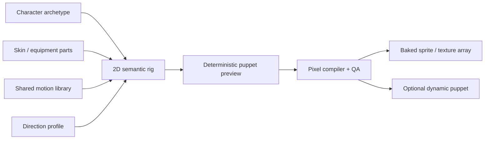

# 2026 AI 模块化二维角色与序列帧管线调研

> 文档类别：Historical research。该方向已推迟到 Hybrid Pixel 里程碑，不得据本文提前启动生产实现。

> 调研日期：2026-08-18  
> 目标：在不依赖完整三维角色资产的前提下，为上百名 Hybrid Pixel/HD-2D 角色建立一致、可复用、Agent 可编辑且运行高效的动画生产管线。

## 结论

不能把“一名角色 × 若干方向 × 若干动作 × 若干帧”全部交给图像模型独立生成。当前生成模型可以降低草图和补帧成本，但仍会改变比例、服装细节、轮廓、锚点和遮挡关系。角色越多、动作越多，返修和一致性检查越接近重新手绘。

建议开发一个 **Semantic 2D Character Rig + Bake-to-Pixel** 系统：

- 以二维分层部件、二维骨架、网格、插槽、方向 Profile 和动作曲线作为可编辑权威源；不要求真正的三维模型。
- 同类角色共享 Skeleton、Motion Library 和语义插槽，只替换头发、脸、躯干、四肢、服装、武器、Palette 等 Skin 部件。
- 简单运动使用 cutout/mesh deformation；手、脚、脸、头发转面和夸张攻击使用局部 cel swap；少数英雄动作允许完整逐帧 override。
- 编辑器中保持 Puppet 可调整，Cook 时默认烘焙成传统 Sprite Sheet/Texture Array。发布运行时仍是低成本 Sprite，不需要让一百个角色持续执行复杂网格变形和多部件 draw。
- AI 主要生成和修订“部件、蒙版、绑定、动作曲线和局部修正”，确定性的引擎烘焙器负责生成全部序列帧。

这不是复制 Spine。关键区别是：源数据 Git 友好、所有部件和动作具有语义、Agent 能查询约束和成本、输出专为像素网格与 Hybrid Pixel 光照设计，并且可以在 Puppet 与烘焙 Sprite 之间切换。

## 一、现有 HD-2D 生产方式确实存在规模问题

[《三角战略》像素美术访谈](https://www.ndw.jp/trianglestrategy_pixelart-interview/)给出了与本项目最直接的证据：

- 角色全部使用像素画；可旋转视角要求考虑八方向和 quarter view 的形变一致性。
- 因工期和工作量，真正完成八方向图的主要角色只有四名。
- 面具采用在原角色上叠加相同部件的方式，说明局部复用有效。
- 原计划让更多角色在转职时更换完整服装，但最终换装集中在十名主要角色。
- 动画先画通用基础姿势，再按每个角色覆画服装；增加一个通用姿势，仍然意味着所有角色都要增加对应素材。
- 大部分动画需要外部协作公司制作，特殊动作仍须逐个排序和控制成本。

这说明传统 HD-2D 项目虽然已经使用基础姿势和局部叠加，权威资产仍然主要是角色级逐帧图，复用没有深入到可编译的角色结构。它正好给本引擎留下了产品空间。

## 二、可以参考的技术栈

### 二维骨骼与 Puppet

| 方案 | 可借鉴能力 | 不直接作为权威格式的原因 |
| --- | --- | --- |
| [Spine Runtimes](https://github.com/EsotericSoftware/spine-runtimes) | 成熟的 bone/slot/skin/mesh/deform/event/animation mixing 设计 | Runtime 有专门许可条件，工具用户可能需要自己的 Spine 许可；版本还需与 Editor 锁步 |
| [Rive Runtime](https://github.com/rive-app/rive-runtime) | MIT C++ Runtime、状态机、数据绑定、跨 D3D/Vulkan/Metal/OpenGL Renderer | 以矢量和交互动画为中心，`.riv` 不适合作为本项目 Git 可审查的像素角色权威源 |
| [Inochi2D](https://github.com/Inochi2D/inochi2d) | BSD-2-Clause 开放 Puppet 标准、分层纹理、网格变形、参数驱动、C FFI | 实现与工具偏 D 语言和 VTuber 使用场景；可研究格式/算法或做导入器，不宜直接绑死核心 Runtime |
| [Godot Cutout Animation](https://docs.godotengine.org/en/stable/tutorials/animation/cutout_animation.html) | 骨架、IK、部件层级、局部 cel animation、粒子和碰撞混用 | 适合验证混合动画原则，不提供本项目需要的 AI Schema 与像素烘焙编译器 |
| [Unity Sprite Skin](https://docs.unity.cn/Packages/com.unity.2d.animation%4010.0/manual/SpriteSkin.html) | 骨架重绑、CPU/GPU deformation、Skin/部件复用 | Unity 自己也强调 CPU/GPU 选择取决于对象数与网格规模；证明不能简单把所有角色放到 GPU skinning |

Godot 官方文档特别支持 cutout 与传统 cel animation 混用：大部分身体用骨架，复杂手脚和表情选择性换帧。这个混合方案比纯 Spine 式连续变形更适合像素画。

### AI 与自动化研究

- [Sprite Sheet Diffusion](https://arxiv.org/abs/2412.03685) 使用角色参考图、Pose Sequence、ReferenceNet、Pose Guider 和 Motion Module 生成动作序列。论文自己报告了小数据集导致的过拟合特征，说明它适合候选生成，不适合作为无需审核的权威生产链。
- [SPRITETOMESH](https://arxiv.org/abs/2602.21153) 把 Sprite 自动转成骨骼动画所需的三角网格。值得借鉴的是“学习负责明确的分割，确定性算法负责多解的顶点布置”，而不是让神经网络预测整个结果。
- [Sketch2Motion](https://arxiv.org/abs/2605.28394) 把生成先验与传统 Skeleton、linear blend skinning、接触和光滑约束结合，验证了“AI 提议动作，经典约束保证稳定”的方向。

这些研究支持同一个判断：AI 更适合提供语义、参考、分割、姿势和候选；拓扑、绑定、锚点、接触、像素网格和导出结构应由确定性系统约束。

## 三、推荐的二维角色权威模型



### Character Archetype

Archetype 定义可复用的身体结构，而不是具体角色：

- `skeleton_id` 与有语义的 bone：root、pelvis、torso、head、upper_arm、hand、weapon_socket 等。
- slot：body、hair_back、face、hair_front、coat、weapon、fx_socket 等。
- 标准比例、pivot、foot contact、shadow anchor、hit/hurt socket。
- 可接受哪些 Direction Profile、动作集和部件规格。

人类、矮人、儿童、四足动物可以是不同 Archetype；同 Archetype 的一百个角色复用动作，不强迫体型差异过大的角色共用一副骨架。

### Skin 与模块化部件

每个角色由部件清单构成：

- 原始 RGBA 或索引色图；Palette 与角色身份分离，允许低成本换色。
- alpha mask、pivot、覆盖 slot、z-order、兼容 Archetype。
- 可选 normal、depth/height、emissive 和 material mask，接入 Hybrid Pixel 灯光。
- 服装与武器使用 attachment，不复制整套身体 Sprite。
- 非对称角色不能盲目镜像；每个方向声明 `mirror_safe` 和需要独立绘制的部件。

### Direction Profile

二维角色转向不是简单旋转骨架。前、后、侧、斜方向会改变部件图像、rest pose、pivot、遮挡顺序和法线/深度响应。因此动作曲线保持方向无关的语义，例如 `left_foot.contact`、`weapon.swing`；Direction Profile 把它映射到各方向的二维 pose、slot 顺序和必要 cel replacement。

### Motion Library

walk、run、idle、hit、cast、attack 保存为骨架曲线、slot event、contact 和语义阶段：

```text
anticipation -> action -> impact -> recovery
```

Agent 可以理解“攻击命中帧”“左脚落地”“披风延迟”而不必从第 7 张 PNG 猜测。动作可在同一 Archetype 内重定向，并允许角色层 additive style，例如老人步幅、重甲延迟或敏捷角色的 recovery 速度。

### 四级混合变形

1. **Rigid Cutout**：头、躯干、武器等刚性部件平移/旋转。
2. **Mesh Deform**：披风、头发和软组织进行小范围 weighted deformation。
3. **Cel Swap**：手、脚、脸、转身轮廓等在指定时间替换局部 Sprite。
4. **Full-frame Override**：英雄必杀、极端透视和严重形变使用完整手绘/AI 修订帧。

纯骨骼会产生关节接缝、旋转插值、亚像素抖动和“纸片人”感；纯逐帧又无法支撑上百角色。四级混合把人工投入集中到真正影响风格的少数帧。

## 四、AI 应该怎样参与

推荐流程：

1. 设计角色参考包：正/侧/背关键视图、轮廓、Palette、部件说明和不变量。
2. AI 生成或分割 body part 候选；引擎检查透明边缘、Palette、尺寸和命名。
3. 自动生成 mesh、bone weight 与 pivot 候选；确定性规则验证关节覆盖和拓扑。
4. 从共享 Motion Library 选择动作，或让 AI 生成受 foot contact、速度和动作阶段约束的曲线。
5. 引擎 Puppet Renderer 生成所有方向和帧；AI 不再逐帧重新解释角色身份。
6. 自动检查 anchor jitter、轮廓闪烁、Palette 漂移、部件穿插、左右腿混淆、脚底滑动和帧间面积变化。
7. 对失败的局部部件或关键帧做 AI/人工修订，以 delta mask/cel override 保存，不重生成整张 Sheet。

这样，生成一致性从“希望模型每次都记得角色”变成“角色始终由同一组部件和同一副 Rig 渲染”。

### 与 Semantic Observation Graph 结合

- 用户说“这个角色走路时右手在第三帧穿过披风”，Agent 根据当前视口、选中角色和帧定位到 `right_hand`、`coat_back`、Direction Profile 和 Motion Clip。
- `character.explain_frame` 返回当前帧的 bone transforms、slot order、cel override、Atlas region、normal/depth 和事件。
- `character.compare_bake` 比较修改前后的图像、锚点、包围盒、Atlas、draw、显存和 Cook 时间。
- 修改以 Rig/Skin/Motion 的结构化 Diff 保存，重新烘焙只是派生产物，不进入人工合并。

建议工具：`character.schema`、`character.assemble`、`character.retarget`、`character.preview`、`character.explain_frame`、`character.validate`、`character.bake`、`character.compare_bake`。

## 五、运行时性能设计

- 常规 NPC 在 Cook 阶段烘焙为 atlas/texture array，运行时通常是一个 Sprite draw，可实例化和批处理。
- Palette swap、法线、材质和少量装备可保留为独立低成本层。
- 玩家自定义角色可在换装时离屏合成到缓存纹理，而不是每帧重画所有身体部件。
- Boss、对话立绘或需要程序化响应的少量对象可以启用 Dynamic Puppet Profile。
- 编辑器同时测 CPU deformation、GPU deformation 和 baked sprite；按对象数量、网格规模和 draw 数选路径，不能默认 GPU 一定更快。
- Cook 输出稳定 Manifest：源 Rig/Skin/Motion hash、方向、帧、pivot、事件、Atlas region、normal/depth 和生成器版本。

这个方案把“生产上的模块化”与“运行时的极简 Sprite”同时保住。动作曲线和骨架共享，常见装备与 Palette 也不必复制每个角色的整套 Sheet。

## 六、首个原型

- 1 个 humanoid Archetype；
- 3 个体型相近但轮廓不同的角色；
- 4 个方向，其中两个允许镜像、两个独立；
- idle、walk、attack 三个共享动作；
- 头发、上衣、武器三个可换部件；
- 一段披风 mesh deform、手/脚 cel swap 和一个 full-frame attack override；
- 同时输出 baked sprite 与 dynamic puppet，比较画质、CPU/GPU、draw、显存、Cook 和修改时间。

成功标准不是“能播放动画”，而是：新增第四个角色时无需重新制作三套动作；修改 walk 命中所有兼容角色；Agent 能定位并修复一个具体穿插帧；烘焙版本维持像素稳定且运行成本接近传统 Sprite。

## 归档论文

- [Sprite Sheet Diffusion PDF](https://arxiv.org/pdf/2412.03685)
- [SPRITETOMESH PDF](https://arxiv.org/pdf/2602.21153)
- [Sketch2Motion PDF](https://arxiv.org/pdf/2605.28394)
