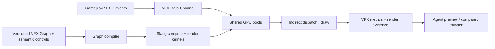
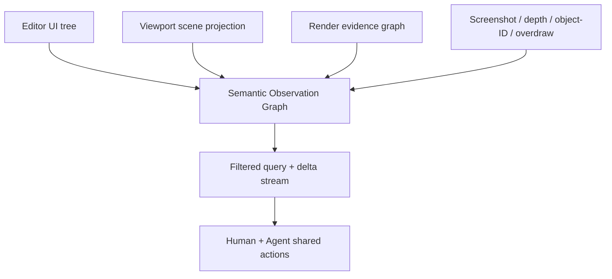

# 2026 VFX、语义观察与 Hybrid Pixel 技术报告

> 文档类别：Historical research。VFX/语义底座已部分落地，Hybrid Pixel 仍属后续 Profile；本文不是当前待办。

> 调研日期：2026-08-18  
> 目标：为 Noemancer 确定粒子/VFX、编辑器语义观察和 HD-2D 验证游戏的实现方向。本文区分已有方案、可直接复用的轮子与本项目真正需要自研的部分。

## 结论

这三个问题应当作为一套系统设计，而不是三个互不相干的功能：

1. 粒子系统采用 **GPU-first、共享模拟、数据驱动的 VFX Graph IR**。AI 修改受约束的图和参数，不默认生成任意 Shader；CPU 只保留玩法权威事件和需要确定性的少量粒子。
2. 编辑器提供 **Engine Semantic Observation Graph**。它同步描述 UI 控件、视口中的场景对象、渲染证据和视觉附件，并用稳定 ID 把它们关联到 ECS、资产和源码。
3. 首个验证游戏采用 **Hybrid Pixel 2.5D Profile**。所谓 HD-2D 不是单一渲染算法，而是像素网格、2D/3D 混合光照、深度排序、像素化后处理和内容制作管线的组合。
4. “高性能”不能由架构名称保证。引擎必须保存固定硬件、固定场景、固定帧和固定画质下的 CPU/GPU/显存/构建证据，并比较修改前后结果。

项目可以形成的特色不是“有 AI 聊天框”，而是：**Agent 能以低上下文成本理解人类正在看的界面和场景，做可撤销修改，并沿着同一组 ID 追查到 VFX、Render Pass、Shader、资源和源码。**

### 创新边界

不能证明“从来没有人做过语义树、场景 API 或截图工具”，这些组成部分都有先例。当前调研中尚未看到成熟开源引擎把以下能力作为统一底座同时交付：

- UI、场景、资产、物理、VFX、Render Graph、性能事件和源码共享可查询的稳定身份；
- 人类当前的 selection、hover、focus 和视口位置能直接约束 Agent 的语言指代；
- 同一份语义模型同时服务 GUI、可访问性、自动化测试、Agent ABI 和 Git 可审查事务；
- 每次 AI 修改都能从界面现象追到数据与代码，再以运行时和性能证据验收。

因此，创新主张应表述为“统一、原生、可验证的语义观察与行动架构”，而不是“第一个把 GUI 转成文字”。是否达到创新标准，需要用公开实现、协议、演示和基准证明。

## 一、面向 Agent 的高性能粒子与 VFX

### 社区方案告诉了我们什么

- [Unreal Niagara Data Channels](https://dev.epicgames.com/documentation/unreal-engine/niagara-data-channels-overview?lang=en-US) 把玩法数据作为流写入 Niagara，也能把大量一次性效果合并到共享模拟，减少每个 System/Emitter 的 CPU 成本。
- [Niagara Scalability](https://dev.epicgames.com/documentation/unreal-engine/scalability-and-best-practices-for-niagara?lang=en-US) 明确提醒：即使粒子在 GPU 上模拟，System 和 Emitter 脚本仍可能消耗 CPU；组件数量和调度同样重要。
- [Unreal Engine 5.8](https://dev.epicgames.com/documentation/unreal-engine/unreal-engine-5-8-release-notes) 已根据粒子数量在 GPU bitonic sort 与 radix sort 之间选择，说明排序策略必须依工作负载切换。
- [Unity Visual Effect Graph](https://docs.unity3d.com/Manual/com.unity.visualeffectgraph.html) 证明 GPU 图式工作流已经成熟，但“图可编辑”不等于“Agent 能理解成本和失败原因”。
- [Effekseer](https://github.com/effekseer/Effekseer) 是成熟、MIT 许可、跨多种图形 API 和引擎的效果编辑器与 Runtime。它适合作为导入器、参考实现和早期内容工具，不适合作为本项目最终诊断模型的边界。
- [Sascha Willems Vulkan Samples](https://github.com/SaschaWillems/Vulkan) 展示了用 storage buffer、compute 和 graphics barrier 构成 GPU 粒子闭环；[GPUParticles](https://github.com/Brian-Jiang/GPUParticles) 展示了 active-list 压缩与 indirect dispatch/draw。

社区实践反复出现两个结论：粒子运动计算并不总是第一个瓶颈；透明像素覆盖、排序、碰撞数据结构以及大量独立组件的调度，经常先耗尽预算。一个粒子系统跑得快，不能只汇报“GPU 粒子数量”。

### AI 编辑方面的新信号

- [Elemental Alchemist](https://arxiv.org/abs/2605.10014) 把自然语言控制拆为高、中、低三层语义，并为参数保存说明、范围和 JSON 路径；结果仍落到确定性的参数化系统。
- [ParticleGen](https://arxiv.org/abs/2608.00629) 将规划与参数化分开，生成结构化、可继续编辑的 Niagara 效果，并根据渲染反馈把视觉问题映射回程序原因。
- [ActionBrushes](https://doi.org/10.1145/3772363.3798553) 用语义滑杆驱动低层参数之间的相关变化，说明“猛烈、轻柔、灼热”一类控制可以编译成有边界的参数变换，而非让模型自由改代码。

这几项工作验证了方向，但还没有解决引擎级的编译成本、GPU 证据、版本控制、运行时安全和跨模块归因。本项目应在这些环节形成差异。

### 建议架构



核心约束：

- VFX Graph 是版本化权威源。节点、端口、参数、单位、允许范围、默认值、语义描述和迁移规则都进入 Schema。
- Graph 编译为中间表示，再生成 Slang compute/render kernel。编译缓存键包含图 hash、Shader hash、平台能力和画质 Profile。
- 粒子状态采用 SoA Buffer、alive/dead list、压缩和 indirect dispatch/draw，生命周期尽量留在 GPU，常规帧不回读。
- 大量同类效果写入共享 Data Channel 和全局池，避免“一次爆炸一个组件、一个 dispatch”。稳定的 effect/emitter ID 用于追踪；不强求每个 GPU 粒子都有永久 GUID。
- 玩法命中、伤害和网络同步属于 ECS/Jolt 权威状态；视觉粒子只消费事件。需要权威性的少量粒子走 CPU 或混合路径，不能给每个火花创建刚体。
- 碰撞分级：视觉近似使用深度、SDF 或静态 BVH；重要事件使用粗粒度 Jolt 查询；昂贵的精确碰撞只对受预算保护的粒子开放。
- 透明度分级：优先 alpha cutout、additive 和无需全排序的材质；必要时按数量选择排序算法；提供低分辨率透明通道和过绘制预算。
- 固定 seed、固定 timestep、frame index 和输入事件流，使预览、测试和前后比较可以复现。

### Agent 操作模型

推荐的默认链路是：

```text
query schema -> propose graph diff -> validate ranges/cost
-> compile candidate -> deterministic preview
-> compare image + metrics -> commit or rollback
```

Agent 默认只能执行结构化操作，例如 `vfx.graph.query`、`vfx.graph.patch`、`vfx.preview`、`vfx.compare` 和 `vfx.explain_cost`。自由代码节点应是显式提权能力，并进入单独审核和 Shader 安全检查。

每次预览至少返回：CPU 事件成本、GPU 模拟/排序/碰撞/渲染耗时、dispatch/draw 数、alive/spawn/dropped 数、显存和带宽估计、覆盖像素/过绘制、Shader 变体与编译耗时。Agent 才能回答“效果更好看了吗”与“代价是什么”。

### 可以直接使用的轮子

| 能力 | 第一选择 | 使用边界 |
| --- | --- | --- |
| Shader 语言与反射 | [Slang](https://github.com/shader-slang/slang) | 作为跨后端内核语言；Graph IR、缓存和诊断映射自研 |
| 效果导入/参考编辑器 | [Effekseer](https://github.com/effekseer/Effekseer) | 先做资产桥接，不让其格式成为引擎内部权威模型 |
| GPU 算法参考 | [Vulkan Samples](https://github.com/SaschaWillems/Vulkan)、[GPUParticles](https://github.com/Brian-Jiang/GPUParticles) | 参考 buffer、barrier、compact、indirect；不直接决定生产架构 |
| CPU 玩法物理 | Jolt | 不扩张为每粒子刚体系统 |

## 二、把 GUI 和视口变成 Agent 可理解的实时语义

### 这件事有人做过吗

基础构件已经存在：

- [Windows UI Automation Tree](https://learn.microsoft.com/en-us/windows/win32/winauto/uiauto-treeoverview) 提供 raw/control/content 三种视图，说明完整树必须经过过滤，否则会产生大量无关节点。
- [Playwright ARIA Snapshot](https://playwright.dev/docs/aria-snapshots) 可把角色、名称、状态和层级输出为紧凑 YAML；[Chrome Accessibility Domain](https://chromedevtools.github.io/devtools-protocol/tot/Accessibility/) 还支持部分树和节点更新事件。
- [AccessKit](https://github.com/AccessKit/accesskit) 使用稳定整数 ID、角色、属性、动作、初始全量树和增量更新，采用 MIT/Apache 双许可，并明确支持 immediate-mode GUI。它很适合作为跨平台可访问性层和语义树底座。
- [Dear ImGui Test Engine](https://github.com/ocornut/imgui_test_engine) 已支持按路径查询和操纵控件、Headless 与快速测试，但商业使用存在额外许可边界；ImGui 本身的[可访问性支持仍是开放问题](https://github.com/ocornut/imgui/issues/8022)。
- [OSWorld](https://arxiv.org/abs/2404.07972) 的 Agent 观察空间同时包含截图、Accessibility Tree 和终端，说明单一观察通道不够。
- Godot MCP、Unreal MCP 和 Summer Engine 等项目已经能暴露 scene tree、运行时状态和截图。它们证明需求存在，但多是工具接口的组合，并未把控件、场景、Render Pass、像素证据与源码统一起来。

所以，这个想法并非无人尝试；真正可做出区别的是更完整的**语义贯通与低开销增量协议**。

### Engine Semantic Observation Graph

文本不能完全替代图片。颜色、构图、材质观感和空间歧义仍需要视觉输入。正确方案是让文本承担结构和定位，让图片只承担视觉证据。



四个同步平面：

1. **编辑器 UI 树**：window/panel/control 的 role、name、value、state、action、bounds、focus、hover、selection、data binding 和 source span。
2. **视口场景投影**：当前可见实体、组件、屏幕包围盒、深度/遮挡、材质、灯光、动画、VFX、语义标签与选中状态。
3. **渲染证据图**：pass、resource、pipeline、shader、effect、draw、过绘制和性能异常，并与现有 Render Diagnostic Graph 共用 ID。
4. **视觉附件**：按需输出截图裁剪、depth、object-ID、normal 和 overdraw buffer，而不是每次把全屏截图塞给模型。

必须从第一版就具备：

- 稳定 `ui_id`、`entity_guid`、`effect_id`、`resource_id` 与 revision；一次用户操作可以沿 data binding 追到 ECS 字段和源码。
- 首次 snapshot 后只发送 `added/changed/removed` delta；空闲帧不序列化整棵树。
- 按窗口、焦点、选区、屏幕区域、最近变化和光标下对象查询；支持懒加载子树与严格结果大小上限。
- 清楚区分 visible、hidden、disabled、occluded；即时模式 UI 也必须由稳定语义模型提供 ID，而不是从绘制调用临时猜测。
- `ui.action` 按语义 ID 执行，不按屏幕坐标点击；所有修改返回 Action Receipt，并能预览、提交或回滚。
- 可访问性、自动化测试和 Agent ABI 共用同一份语义源。它既减少重复实现，也让编辑器天然更容易支持屏幕阅读器。

当用户说“我刚选中的角色头发太亮”时，Agent 先查询 selection、hover 和最近交互，再取得角色材质、灯光、相关 Render Pass 与一张局部 crop。只有目标仍有歧义时才询问。这个“指示语落地”比持续截图更准确，也显著降低上下文量。

建议接口：`ui.snapshot`、`ui.diff`、`ui.query`、`ui.action`、`viewport.describe`、`viewport.pick`、`viewport.visible_entities`、`render.explain_pixel`、`observation.bundle`。

### 性能边界

语义观察不能反过来拖慢编辑器和游戏：

- 发布游戏默认裁剪编辑器语义和调试字符串；运行时只保留显式开启的开发 Profile。
- UI/ECS 使用 dirty bit 和 revision 生成 delta；采集线程消费不可变快照，不阻塞渲染线程。
- 图像附件与 GPU readback 必须按需、限频并异步；普通文本查询不触发截图。
- 分别测量 disabled、基础 ID marker、完整 capture 三档开销，并让预算成为 CI 指标。

## 三、HD-2D 是否对应具体技术

有具体技术，但没有一个叫“HD-2D Renderer”的标准算法。[Octopath Traveler 的 Unreal Fest 演讲](https://www.unrealengine.com/events/unreal-fest-europe-2019/the-fusion-of-nostalgia-and-novelty-in-the-development-of-octopath-traveler?lang=en-US) 与[开发者访谈](https://www.unrealengine.com/developer-interviews/octopath-traveler-ii-builds-a-bigger-bolder-world-in-its-stunning-hd-2d-style?lang=en) 展示的是像素角色、3D 场景、动态光照、景深、雾、粒子和后处理的融合。工程上应称为 **Hybrid Pixel 2.5D Profile**，不把外部品牌名称当成内部架构。

### 需要实现的具体能力

- 固定 virtual resolution、整数倍缩放、nearest sampling 与统一 pixel-grid contract。
- 相机和世界对象 pixel snapping；正交/透视模式都要避免静止和慢速移动时的 pixel crawl。
- billboard、方向性 Sprite 与 2D/3D 坐标转换；提供 3D 模型向多方向 Sprite/法线/深度图的烘焙器。
- Sprite 的 depth、height、normal、emissive 和 material mask，使平面角色能接受 3D 灯光、雾和阴影。[Pixel Art Normal Map Generation](https://arxiv.org/abs/2212.09692) 说明像素画法线需要保持风格，不能直接套用普通照片或 3D 方法。
- alpha-cutout depth prepass、atlas/bindless batching、分层或逐像素深度排序，解决 Sprite 与 3D 几何的遮挡。
- 为像素画规定后处理顺序，分别控制 pixelation、bloom、DOF、fog、volumetric 和 TAA，避免柔化边缘、光晕污染与过度景深。
- Hybrid tilemap + 3D 关卡编辑、统一碰撞/导航/音频，不把 2D 与 3D 内容拆成两套孤岛。
- VFX Pixel Mode：低分辨率粒子通道或量化位置/尺寸、像素对齐 trail、Palette/光照融合，并能选择 cutout 以降低 overdraw。
- Semantic 2D Character Rig、共享动作、方向 Profile、局部 cel swap 与 Bake-to-Pixel 管线；详细设计见 [AI 模块化二维角色调研](2026-ai-modular-2d-character-pipeline.zh-CN.md)。
- 专项诊断：非整数缩放、采样器错误、pixel crawl、Sprite/世界错位、透明排序、halo、过绘制和后处理破坏像素边缘。

### 能否成为卖点

可以，但卖点必须是完整工作流，而不是渲染设置中的一个复选框。建议对外使用自有能力名称，例如 **Hybrid Pixel** 或 **Pixel Diorama Profile**，再说明它面向通常所说的 HD-2D/2.5D 像素风格。

成立条件包括：

- 美术能直接导入 Sprite，在 3D 场景中得到稳定的像素、光照、遮挡和阴影结果；
- 引擎提供方向 Sprite、法线/深度生成、Pixel VFX、相机与后处理模板，而非要求每个项目重新拼 Shader；
- 编辑器实时指出 pixel crawl、错误缩放、透明排序和过绘制问题；
- Agent 能理解视口对象和像素渲染约束，完成“描述问题—定位对象—修改—预览—性能验证”；
- 有一款完成度足够高的验证游戏以及可复现的目标硬件数据。

若做到这些，它不是“Godot/Unreal 也能手工做出的风格”，而是一条显著缩短生产时间、降低技术门槛并能由 Agent 操作的专用管线。

HD-2D 并不天然便宜。大量透明 Sprite、景深、Bloom、体积光、3D 阴影和全屏低分辨率再放大会消耗填充率与带宽。性能路径需要 cutout/depth prepass、批处理、GPU culling、低分辨率透明/后处理和分级画质；必须在低端独显与集显上分别建立基线。

### 验证游戏为什么合适

Hybrid Pixel RPG 是一条很好的纵向切片，因为它会同时压测：2D/3D 资产管线、灯光、透明粒子、角色动画、C# 玩法脚本、UI、存档、场景 Diff、内容 Cook、语义观察和确定性测试。但引擎核心仍应实现可组合的 Profile，不能只针对一款 RPG 写死。

建议至少准备四类固定场景：

1. 像素角色与 3D 场景的相机移动和遮挡测试。
2. 大量角色、Sprite 灯光与阴影的 CPU/GPU 批处理测试。
3. 全屏战斗 VFX torture scene，分别测模拟、排序、透明覆盖与后处理。
4. 用户边运行边描述问题的 Agent 测试，统计目标解析成功率、上下文 bytes、工具调用数和完成时间。

## 四、实施顺序

### Phase A：语义底座先行

- 定义 UI/Scene/Render 共用的稳定 ID 与 revision。
- 用 AccessKit 数据模型做第一个编辑器 UI semantic snapshot/delta 尖峰。
- 实现 selection、hover、focus、cursor pick 与局部 screenshot crop 的 observation bundle。
- 对比“纯截图”“整树文本”“过滤树 + 局部图片”的成功率和上下文成本。

### Phase B：VFX 最小闭环

- 定义 VFX Graph Schema、Emitter/Event Data Channel 和固定 seed 预览格式。
- 完成一个 GPU pool、alive/dead compact、indirect draw 与 metrics 输出。
- 先支持 spawn、forces、color/size over life、cutout/additive、depth collision 和 Pixel Mode。
- 导入一个 Effekseer 示例，证明外部内容可迁移；同时保留本地权威 Graph。

### Phase C：Hybrid Pixel 垂直切片

- 建立 virtual resolution、pixel snapping、Sprite material/depth/normal 和后处理顺序。
- 做一间可游玩的 3D 房间、一个像素角色和一场高密度战斗。
- Agent 通过语义图完成一次“定位角色—修改材质/VFX—热预览—性能比较—回滚/提交”。

### 验收标准

- AI 友好：图、场景和 UI 的权威修改可 Diff、可验证、可回滚；不依赖聊天历史成立。
- 运行时性能：固定 workload 的 P50/P95 CPU frame、GPU frame、显存、draw/dispatch、overdraw 和 loading/cook 数据可持续比较。
- 观察开销：disabled、基础 marker、完整 capture 三档都有测量；空闲状态不会持续输出整树。
- 视觉正确：固定 seed 的 VFX 与 Hybrid Pixel golden scene 可重放；截图只作为证据之一，并能回到实体、材质、Pass 和源码。

## 归档论文

- [Elemental Alchemist PDF](https://arxiv.org/pdf/2605.10014)
- [ParticleGen PDF](https://arxiv.org/pdf/2608.00629)
- [Pixel Art Normal Map Generation PDF](https://arxiv.org/pdf/2212.09692)
